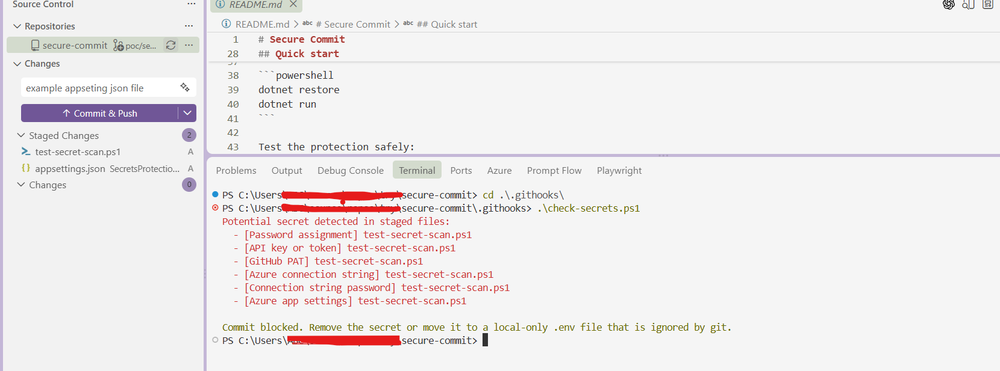
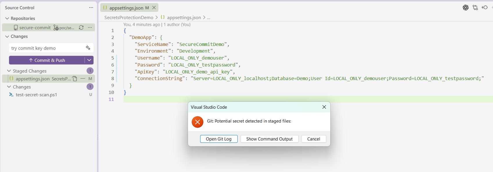

# Secure Commit

A practical demonstration of shift-left secret protection in developer workflows. This repository shows how to detect and block API keys, passwords, tokens, connection strings, and other sensitive values before they enter Git history.

## Overview

Secret leaks often occur when developers accidentally commit configuration files or sample values without realizing the risk. This project implements a simple, local-only defense: detect risky content at the staged-file level, before the commit is created.

The protection is entirely local, requires no external services, and integrates seamlessly into the standard Git workflow.

## Contents

- .NET 10 sample application for configuration testing
- strong `.gitignore` patterns for secret-like files
- local Git pre-commit hook with PowerShell scanner
- safe validation script that proves the blocker works

## How it works

1. Stage files for commit with `git add`.
2. Git invokes the local pre-commit hook automatically.
3. PowerShell scans staged content for suspicious patterns.
4. If patterns match, the commit is blocked with a clear message.
5. Developer fixes the issue and retries the commit.

No external services or network calls are required.

## Quick start

Enable the Git hooks directory:

```powershell
git config core.hooksPath .githooks
```

Run the sample app:

```powershell
dotnet restore
dotnet run
```

Example of running the check-secrets protection safely:


Example of running the check-secrets protection with a staged file that contains a secret:


## Patterns detected

- password and API key assignments
- connection strings with credentials
- tokens and bearer-style values
- Azure and cloud connection settings
- hardcoded application secrets in config files

## Best practices

- Never commit real secrets to any branch.
- Use local-only config, environment variables, or `.example` template files instead.
- Review staged files before committing.
- Rotate any secret that reaches the remote repository.

## What this demonstrates

Shift-left security means catching problems early in the developer workflow, before code reaches shared branches or production systems.
